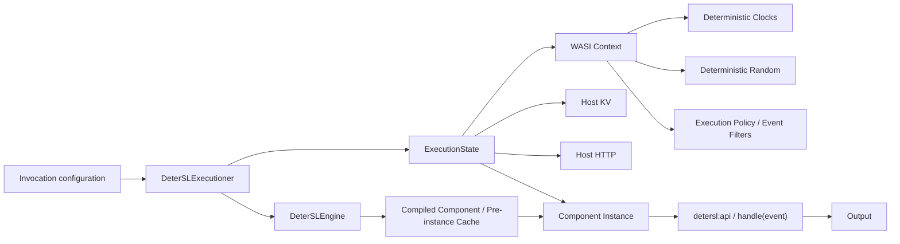

# wasm-exec-env

**A deterministic execution environment for WebAssembly Component Model workloads, built on Wasmtime.**

`wasm-exec-env` provides a controlled host environment for executing WebAssembly components reproducibly. It replaces nondeterministic host inputs such as clocks and randomness with explicitly configured values, while providing policy-controlled access to WASI capabilities and host-managed resources.

The runtime is used by [DeterSL](https://github.com/DeterSL/multi-threaded-worker) to execute serverless functions in an environment suitable for deterministic re-execution and replay.

## Motivation

A WebAssembly function may be deterministic at the language level and still observe nondeterministic state from its host environment.

For example:

- `clock_time_get()` can return a different value on every execution.
- random APIs normally return different data on every execution.
- filesystem, sockets, and other host interfaces may expose changing external state.
- state provided by the host may differ between executions.

For systems that need to **re-execute the same function and reproduce its behavior**, these sources of nondeterminism need to be controlled.

`wasm-exec-env` builds a Wasmtime/WASI execution context in which guest-visible host inputs can be explicitly configured.

Conceptually:

```text
same component
+ same input
+ same initial clock
+ same random seed
+ same controlled external state
--------------------------------
          reproducible execution
```

## What is deterministic?

### Deterministic clocks

Each invocation receives configured wall and monotonic clocks.

The current clock implementations are frozen: calls to `now()` return the configured `init_clock` value rather than the host machine's current time.

```json
"func_initial_values": {
  "init_clock": 0,
  "random_seed": 42
}
```

A component executed repeatedly with the same `init_clock` therefore observes the same clock value.

### Deterministic randomness

Both secure and insecure WASI random sources are replaced with a deterministic host implementation.

The current implementation uses a `ConstantRng`: the configured seed is converted to one byte and that byte is repeated for generated random data.

For example, a seed of `42` produces deterministic byte streams containing `0x2a`.

> **Current limitation:** `random_seed` is represented as a `u128` in the configuration, but the current RNG implementation converts it to `u8`. Use values in the range `0..=255`.

### Capability policies

The runtime can also restrict guest access to nondeterministic host facilities.

Policies are supported for:

- clocks,
- random number generation,
- filesystem operations,
- CLI/environment operations,
- TCP,
- UDP.

The runtime uses an event-filter mechanism in the DeterSL Wasmtime fork to decide whether individual host operations are permitted.

For example:

```json
"func_execution_policy": {
  "allow_clocks": true,
  "allow_filesystem": false,
  "allow_random": true,
  "allow_cli": true,
  "allow_socket": false
}
```

More fine-grained policies are available for clocks, filesystem operations, and sockets.

## Determinism boundary

`wasm-exec-env` makes selected **host inputs deterministic**. It does not attempt to magically make all external systems deterministic.

In particular, components may interact with:

- the DeterSL KV interface,
- the DeterSL HTTP interface,
- permitted filesystem operations,
- permitted network operations.

If those resources expose different state during replay, the component can still observe different behavior.

For deterministic replay, external state should therefore be reproduced, versioned, or otherwise controlled by the embedding runtime.

This is how `wasm-exec-env` is used inside DeterSL: the worker supplies the WebAssembly execution environment with the resource state associated with the currently executing workflow task.

## Architecture



The main runtime layers are:

1. **`DeterSLEngine`** — owns the Wasmtime engine, linker, and shared cache of compiled/pre-instantiated components.
2. **`DeterSLExecutioner`** — drives component lookup, compilation, instantiation, and invocation.
3. **`ExecutionState`** — contains the per-execution WASI context, resource table, KV implementation, HTTP context, deterministic clocks/randomness, and execution policy.
4. **Component bindings** — generated from the WIT world under `src/wit/`.
5. **C++ FFI** — exposes the runtime through `cxx` for embedding in native systems such as DeterSL.

## WebAssembly Component interface

Components execute against the `detersl:api@0.2.0` Component Model world.

The main exported function interface is:

```wit
package detersl:api@0.2.0;

interface func-handler {
    record event {
        data: string,
    }

    record output {
        data: string,
    }

    handle: func(event: event) -> output;
}
```

The world also includes the DeterSL KV and HTTP APIs together with WASI I/O:

```wit
world detersl-api {
    export func-handler;
    include detersl:kv-api/kv-api@0.2.0;
    include detersl:http-api/http-api@0.2.0;
    include wasi:io/imports@0.2.6;
}
```

The KV interface exposed to components is:

```wit
interface kv {
    get: func(key: string) -> option<list<u8>>;
    set: func(key: string, value: list<u8>);
    delete: func(key: string) -> bool;
}
```

## Building

### Rust

Clone the repository and build with Cargo:

```bash
git clone https://github.com/DeterSL/wasm-exec-env.git
cd wasm-exec-env

cargo build --release
```

The crate builds:

- the `detersl` Rust library,
- a static library for native embedding,
- the `detersl-server` executable.

The runtime currently depends on the DeterSL Wasmtime fork and its `release-35.0.0-detersl` branch.

### CMake / C++ embedding

The project can also be built as a CMake subdirectory:

```cmake
add_subdirectory(external/wasm-exec-env)

target_link_libraries(my_runtime PRIVATE
    detersl::ffi
)
```

The build generates the `cxx` bridge headers and the Rust static library required by C++ consumers.

The CMake integration requires CMake 3.16 or newer and builds the C++ bridge using C++17.

### Execution-policy filters in Release builds

The CMake configuration currently enables these features automatically for Release builds when no feature list is supplied:

```text
noop-logger
noop-filter
```

`noop-filter` disables execution-policy filtering.

If execution-policy enforcement is required in a CMake Release build, explicitly provide a feature set that does **not** contain `noop-filter`. For example:

```bash
cmake -S . -B build \
    -DCMAKE_BUILD_TYPE=Release \
    -DDETERSL_CARGO_FEATURES=noop-logger

cmake --build build -j
```

A regular Cargo build does not enable `noop-filter` unless requested explicitly.

## Standalone server

The repository contains a small standalone HTTP server for executing components.

Start it with:

```bash
cargo run --release --bin detersl-server
```

The server listens on:

```text
http://0.0.0.0:3000
```

and accepts function invocations through:

```text
POST /run
```

The server creates a shared `DeterSLEngine` and a set of execution workers, with the number of workers based on the host's available parallelism.

## Invocation configuration

Executions are described using a JSON `FuncBinaryConfig`.

For example:

```json
{
  "func_name": "example",
  "func_invocation_id": "invocation-1",
  "func_binary_hash": "replace-with-component-identity",
  "fast_execution": false,

  "func_binary_source": {
    "type": "fs",
    "path": "/absolute/path/to/component.wasm"
  },

  "func_input_event": {
    "type": "data",
    "data": "{\"hello\":\"world\"}"
  },

  "func_output_event": {
    "type": "default"
  },

  "func_link_opt": {
    "link_clocks": true,
    "link_filesystem": true,
    "link_random": true,
    "link_cli": true,
    "link_io": true,
    "link_socket": true
  },

  "func_execution_policy": {
    "allow_clocks": true,
    "allow_filesystem": false,
    "allow_random": true,
    "allow_cli": true,
    "allow_socket": false
  },

  "func_initial_values": {
    "init_clock": 0,
    "random_seed": 42
  }
}
```

Save this as `function.json` and invoke the standalone server with:

```bash
curl -sS \
  -X POST http://127.0.0.1:3000/run \
  -H 'content-type: application/json' \
  --data-binary @function.json
```

The component's returned `output.data` is serialized as:

```json
{
  "data": "..."
}
```

## Function configuration

| Field | Purpose |
|---|---|
| `func_name` | Function metadata/name. |
| `func_invocation_id` | Invocation metadata supplied by the caller. |
| `func_binary_hash` | Identity used for component compilation/pre-instance caching. |
| `fast_execution` | Reuse an instantiated component between executions when possible. |
| `func_binary_source` | Location from which the component is loaded. |
| `func_input_event` | Input passed to the exported `handle` function. |
| `func_output_event` | Output handling mode. Currently only `default` is defined. |
| `func_link_opt` | Link-option schema retained for compatibility; see below. |
| `func_execution_policy` | Controls permitted host/WASI operations. |
| `func_initial_values` | Deterministic clock and random initial values. |

### Component sources

Components can currently be obtained from either the local filesystem or HTTP.

Local file:

```json
{
  "type": "fs",
  "path": "/path/to/function.wasm"
}
```

HTTP:

```json
{
  "type": "http",
  "url": "https://example.com/function.wasm",
  "headers": {
    "authorization": "Bearer ..."
  }
}
```

Local paths are canonicalized before loading.

HTTP components are downloaded into the engine's configured `module_save_path`.

> When using HTTP component sources, configure `module_save_path` explicitly.

## Execution policies

### Clocks

Allow both clocks:

```json
{
  "allow_clocks": true
}
```

Or disable clocks globally and selectively enable one:

```json
{
  "allow_clocks": false,
  "clocks": {
    "wall_clock": true,
    "monotonic_clock": false
  }
}
```

### Filesystem

Filesystem access can be disabled completely:

```json
{
  "allow_filesystem": false
}
```

or selectively enabled:

```json
{
  "allow_filesystem": false,
  "filesystem": {
    "read_fs": true,
    "write_fs": false,
    "open_fs": true,
    "list_dir": true,
    "make_dir": false,
    "rm_dir": false,
    "read_dir": true,
    "rename_dir": false
  }
}
```

### Randomness

```json
{
  "allow_random": true
}
```

When enabled, random operations observe the deterministic RNG configured by `func_initial_values.random_seed`.

### Sockets

Socket operations can be enabled globally or controlled independently for TCP and UDP.

For example:

```json
{
  "allow_socket": false,
  "socket": {
    "udp": {
      "receive": false,
      "send": false,
      "creation": false
    },
    "tcp": {
      "read": false,
      "write": false,
      "connect": false,
      "listen": false,
      "accept": false,
      "creation": false
    }
  }
}
```

## `func_link_opt` and execution policies

Earlier versions of the runtime used selective linking as the mechanism for preventing a component from accessing host APIs.

That approach is still represented by `FuncLinkOpt`.

The current execution path instead links the WASI interfaces required by components and enforces permissions through **runtime event filters**. This is necessary for languages and runtimes that require interfaces to be present at instantiation time even if the application itself does not use them.

For new integrations, `func_execution_policy` is therefore the relevant runtime capability-control mechanism.

## Fast execution

Component compilation and instantiation can be significant for short-running functions. `wasm-exec-env` therefore contains two levels of reuse:

- compiled/pre-instantiated components are cached by component identity;
- `fast_execution` can additionally reuse a previously instantiated component.

Enable it with:

```json
{
  "fast_execution": true
}
```

Before a cached invocation is reused, the runtime resets the host-side execution state:

- deterministic clocks,
- deterministic randomness,
- execution policy,
- WASI resource table,
- HTTP context,
- injected KV backend.

However, the **guest component instance itself is reused**.

This is an important semantic distinction: guest memory or other guest-side state may survive between fast executions.

If each invocation must begin from a completely fresh component instance, use:

```json
{
  "fast_execution": false
}
```

## Engine configuration

The Wasmtime engine can be configured independently from each function invocation.

Example:

```json
{
  "cache_enabled": true,
  "strategy": "cranelift",
  "memory_init_cow": true,

  "memory_guard_size": -1,
  "memory_reservation": -1,

  "lrucache_capacity": 1024,
  "module_save_path": "./modules",

  "allocation": {
    "kind": "on_demand",
    "pooling": {}
  }
}
```

Supported engine options include:

- Wasmtime cache enablement,
- `cranelift` or `winch` compilation,
- copy-on-write memory initialization,
- memory guard/reservation configuration,
- on-demand or pooling allocation,
- pooling allocator parameters,
- compiled/pre-instantiated component cache capacity,
- a directory for remotely downloaded components.

A value of `-1` for supported numeric Wasmtime settings means to retain the Wasmtime default.

## Rust API

The primary modules exported by the crate are:

```rust
pub mod core;
pub mod config;
pub mod ffi;
```

The high-level execution path is centered around:

```text
DeterSLEngine
    |
    +-- DeterSLExecutioner
            |
            +-- FuncBinaryConfig
            |
            +-- compile / cache
            |
            +-- ExecutionState
            |
            +-- invoke component
```

`DeterSLExecutioner` can either execute a configuration immediately or compile its component ahead of execution.

## C++ API

The project exposes a C++ interface using [`cxx`](https://cxx.rs/).

The bridge provides operations for:

- creating an engine from a JSON file,
- creating an engine from a JSON string,
- creating an executioner,
- compiling a component,
- executing a function configuration,
- using the built-in KV implementation,
- injecting a custom C++ KV implementation.

A minimal embedding looks conceptually like:

```cpp
#include "ffi.rs.h"

auto engine =
    new_detersl_engine_from_file(std::string("./engine.json"));

auto executioner =
    new_executioner(*engine, new_dummy_kv());

std::string config_json = /* invocation configuration */;

auto output =
    executioner->executioner_run_json(config_json);
```

For integration with an existing state-management system, implement `KVInterface` and pass it through `new_cpp_kv(...)`.

## KV integration

Components see a small key-value API:

```text
get(key)
set(key, value)
delete(key)
```

The standalone runtime provides an in-memory `DummyKV`.

Native applications can inject their own implementation through the C++ bridge. This allows the WebAssembly component to operate on state owned and synchronized by the embedding system rather than maintaining an independent storage layer.

## Use in DeterSL

[`DeterSL/multi-threaded-worker`](https://github.com/DeterSL/multi-threaded-worker) embeds `wasm-exec-env` as a Git submodule.

The integration uses the runtime as follows:

```text
DeterSL worker
    |
    +-- one shared DeterSLEngine
    |
    +-- function registration
    |      |
    |      +-- compile Wasm component
    |
    +-- worker thread
           |
           +-- thread-local WasmExecution
           |
           +-- inject ResourceStorage as KV
           |
           +-- execute component
           |
           +-- return updated ResourceStorage
```

Function registration compiles the WebAssembly component ahead of execution.

During workflow execution, each worker thread maintains a `WasmExecution` object. Before invoking a function, DeterSL injects the workflow resources acquired for that task through the `KVInterface`. The WebAssembly component then reads and modifies those resources through the DeterSL KV WIT interface.

For example, a DeterSL function manifest can specify:

```json
{
  "func_execution_policy": {
    "allow_clocks": true,
    "allow_filesystem": false,
    "allow_random": true,
    "allow_cli": true,
    "allow_socket": false
  },
  "func_initial_values": {
    "init_clock": 0,
    "random_seed": 42
  }
}
```

This gives repeated executions the same clock and random environment while the DeterSL worker controls the function's state through its resource system.

## Repository layout

```text
.
├── Cargo.toml
├── CMakeLists.txt
├── build.rs
├── include/
│   ├── ffi.rs.h
│   └── kv_api.h
└── src/
    ├── config/
    │   ├── engine/            # Wasmtime / DeterSL engine configuration
    │   └── func/              # Per-function execution configuration
    │
    ├── core/
    │   ├── bindings/          # Generated Component Model bindings
    │   ├── detersl_linker/    # Linker support
    │   ├── detersl_wasi/      # Clock, random, KV, HTTP, logging
    │   ├── engine/            # Engine, caches, invocable components
    │   ├── execution/         # Per-invocation ExecutionState
    │   ├── executioner/       # High-level compile/invoke path
    │   ├── fetcher/           # Filesystem and HTTP component loading
    │   ├── types/             # Input/output runtime types
    │   └── worker/            # Standalone server execution workers
    │
    ├── ffi.rs                 # Rust <-> C++ bridge
    ├── lib.rs
    ├── main.rs                # Standalone HTTP server
    │
    └── wit/
        ├── world.wit
        ├── func-handler.wit
        └── deps/
            ├── http/
            ├── io/
            └── kv/
```

## Current limitations

`wasm-exec-env` is under active development. In particular:

- The deterministic RNG currently repeats a single byte rather than generating a seeded pseudo-random sequence.
- `random_seed` must currently fit into `u8`.
- Full deterministic replay requires external KV, HTTP, filesystem, and network state to be controlled by the embedding system.
- The custom DeterSL HTTP interface represents an external side effect and should be avoided or controlled during deterministic replay.
- `fast_execution` reuses the guest component instance, so guest-side state can persist.
- HTTP component loading should be used with an explicitly configured `module_save_path`.
- Building with the `noop-filter` feature disables capability-policy filtering.

## Related project

`wasm-exec-env` is the WebAssembly execution layer used by:

- [DeterSL multi-threaded worker](https://github.com/DeterSL/multi-threaded-worker) — a deterministic multithreaded serverless worker for durable workflows.
